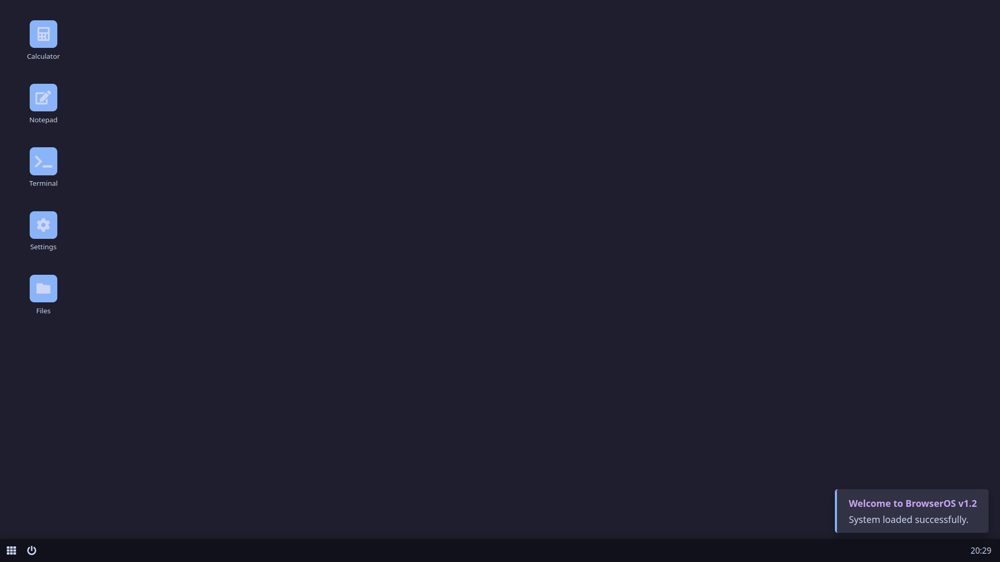

# BrowserOS v1.2

  

#BrowserOS v1.2

✨ Description

BrowserOS v1.2 is the second version of an experimental browser-based operating system built with HTML, CSS, and JavaScript. This OS runs directly in the browser and provides a convenient minimalist interface with essential functions. It is just a simulation and does not replace a real operating system.

🔧 Features

📁 Desktop with customizable wallpapers (black, animated, gradient)

🔄 Bottom taskbar with access to essential applications

🎨 Customization (change icon colors, light/dark theme)

🔢 Window manager (create folders, drag, and resize windows)

⚙️ Settings for personalizing the interface

📝 Notepad for quick notes

🤖 Terminal for running commands

📊 Calculator with basic math operations

💎💎💎💎💎💎💎💎💎💎💎💎💎💎💎💎💎💎💎💎💎💎💎💎💎💎💎💎💎💎💎💎💎💎💎💎💎💎
ВЕСРИЯ 1.2
СИМУЛЯЦИЯ ФАЙЛОВОГО МЕНЕДЖЕРА
УВЕДОМЛДЕНИЯ БОЛЬШЕ УВЕДОИМЛЕНИЙ
ЗВУКИ ВРУБИТЕ В В НАСТРОЙКАХ ЕСЛИ НЕТУ

💎💎💎💎💎💎💎💎💎💎💎💎💎💎💎💎💎💎💎💎💎💎💎💎💎💎💎💎💎💎💎💎💎💎💎💎💎💎

Youtube video about the BrowserOs v1.0
https://youtu.be/gCIwcJKanVg?si=OKkQ8vy7rvKRz4U7

Enjoy using BrowserOS! 🚀

🛠️ Future Updates

UI improvements

Advanced window settings

Performance optimizations

This is just version 1.2, and many exciting updates are coming soon! Stay tuned for new releases.

⚙️ Technologies

HTML – system structure

CSS – styling and design

JavaScript – logic and interactive functions

✨ Author

[MewnityTech](https://github.com/MewnityTech)

BrowserOS v1.0

✨ Описание

BrowserOS v1.0 — это первая версия экспериментальной браузерной операционной системы, созданной с использованием HTML, CSS и JavaScript. Эта ОС запускается прямо в браузере и предоставляет удобный минималистичный интерфейс с базовыми функциями. Это всего лишь симуляция и не заменяет настоящую операционную систему.

🔧 Функции

📁 Рабочий стол с возможностью менять обои (чёрные, анимированные, переливающиеся)

🔄 Нижняя панель задач с доступом к основным приложениям

🎨 Кастомизация (изменение цвета иконок, светлая/тёмная тема)

🔢 Оконный менеджер (создание папок, перетаскивание и изменение размера окон)

⚙️ Настройки для персонализации интерфейса

📝 Блокнот для быстрого создания заметок

🤖 Терминал для выполнения команд

📊 Калькулятор с базовыми математическими операциями

Нажмите F11 для полноекранного сайта!

Youtube видео про BrowserOs v1.0
https://youtu.be/gCIwcJKanVg?si=OKkQ8vy7rvKRz4U7

Наслаждайтесь работой с BrowserOS! 🚀

🛠️ Будущие обновления

Улучшение интерфейса

Оптимизация работы

Это только первая версия (v1.0), и впереди нас ждёт много крутых обновлений! Следите за новыми релизами.

⚙️ Технологии

HTML — структура системы

CSS — оформление и стилизация

JavaScript — логика работы и интерактивные функции

✨ Автор 

[MewnityTech](https://github.com/MewnityTech)

💎💎💎💎💎💎💎💎💎💎💎💎💎💎💎💎💎💎💎💎💎💎💎💎💎💎💎💎💎💎💎💎💎💎💎💎💎💎
ВЕСРИЯ 1.2
СИМУЛЯЦИЯ ФАЙЛОВОГО МЕНЕДЖЕРА
УВЕДОМЛДЕНИЯ БОЛЬШЕ УВЕДОИМЛЕНИЙ
ЗВУКИ ВРУБИТЕ В В НАСТРОЙКАХ ЕСЛИ НЕТУ

💎💎💎💎💎💎💎💎💎💎💎💎💎💎💎💎💎💎💎💎💎💎💎💎💎💎💎💎💎💎💎💎💎💎💎💎💎💎
